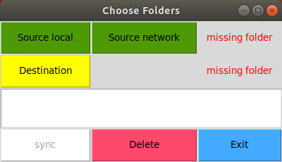
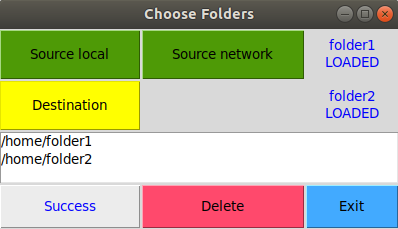

# Аннотация
GUI приложение для быстрой синхронизации папок.

## Поддерживаемые платформы
* Linux 

## Требования:
* python3, библиотеки:
  * sys
  * os
  * dirsync
  * tkinter

### Запуск
```
python3 folder_sync.py
```

# Описание
Запуск осуществляется командой:
```
python3 folder_sync.py
```
<p align="center">
</p>

Пользователю предлагается выбрать папку, из которой будут синхронизироваться данные: 
* source local (локальная папка)
* source network ([сетевая папка](https://gitlab.com/agaltsev.stas/folder-sync/-/wikis/%D0%9C%D0%BE%D0%BD%D1%82%D0%B8%D1%80%D0%BE%D0%B2%D0%B0%D0%BD%D0%B8%D0%B5-%D1%81%D0%B5%D1%82%D0%B5%D0%B2%D0%BE%D0%B9-%D0%BF%D0%B0%D0%BF%D0%BA%D0%B8))

Пользователь также должен выбрать папку, в которую будут копироваться и удаляться лишние файлы:
* destination (назначение)

Пример успешной синхронизации показан на рисунке ниже.
<p align="center">
</p>


